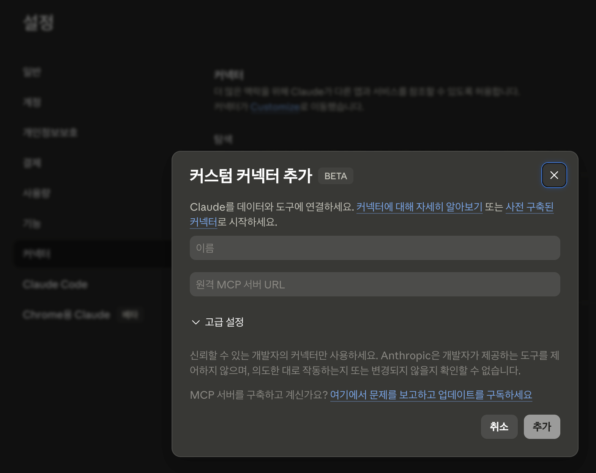

# Korean Law ALIO MCP

[](https://www.npmjs.com/package/korean-law-alio-mcp)
[](https://modelcontextprotocol.io)
[](./LICENSE)
[](./docs/API.md)
[](#-what-this-fork-adds-vs-upstream-v22)

---

An MCP for searching, comparing, and analyzing Korean national law (법제처) and the internal regulations of public institutions (ALIO).

110 MCP tools — 87 Korean Law portal + 23 ALIO public-institution regulations — perform the analysis.

Searches and compares 1,600 active laws, 10,000 administrative rules, tens of thousands of court precedents, and 35,000 internal regulations across 344 public institutions, then feeds the results to your AI assistant for higher-quality answers.

This project is derived from [chrisryugj/korean-law-mcp](https://github.com/chrisryugj/korean-law-mcp).

[한국어](./README.md)


---

## Why this was built

Thanks to [korean-law-mcp](https://github.com/chrisryugj/korean-law-mcp), accessing Korea's national law has become much easier and supports public-sector work daily. Sincere thanks again to [chrisryugj](https://github.com/chrisryugj).

We believed that combining national laws with public-institution internal regulations would multiply the value. This fork was therefore developed using regulation data from [ALIO](https://alio.go.kr/).

May this help those who find legal access difficult, and the public-institution staff across the country who struggle with internal regulation management.

---

## v1.0.8 — Bridging Public-Institution Regulations with Korean National Law

On top of the upstream's 87 Korean-Law tools, this fork adds **23 ALIO public-institution tools + 3 tools that link the two areas** — 110 tools that search, compare, and analyze 1.27 GB of data (Korean Law portal + 35,000 public-institution internal regulations) through natural language.

### What this fork adds

- **23 ALIO tools** — integrates 35,000 internal regulations from 344 Korean public institutions
- **3 tools that link public-institution regulations with Korean national laws**
  - Auto-extracts upper laws cited in a public-institution regulation's body and looks up each law's identifier at the Korean Law portal
  - Given a Korean Law portal statute, reverse-looks up the public-institution regulations across the country that cite it
  - Analyzes how articles within a single regulation cite/refer to one another
- **Setup wizard** — `npx korean-law-alio-mcp setup` (API key → operating mode → multi-client selection → config auto-registration)
- **fly.io remote MCP** — `https://korean-law-alio-mcp.fly.dev` (110 tools + ALIO data; best-effort to keep it running)

### Example — natural-language queries linking 📜 the Korean Law portal and 🏢 ALIO public-institution internal regulations

```
"Show me the upper laws related to ○○ Agency's HR regulations"
```

→ Given the natural-language query, the AI automatically:

- Analyzes the institution's HR regulation body and extracts cited upper laws
- Looks up each cited law's identifier at the Korean Law portal and attaches it

Example outcome:

> "Found about 10+ upper-law citations in the HR regulation body (e.g., general HR/labor laws, occupational safety laws, gender-equality laws, etc.). Identifiers are attached for follow-up lookups."

```
"Check whether ○○ Corporation's OOO directive stays within the delegation scope of its parent laws"
```

→ Given the natural-language query, the AI automatically:

- Extracts the delegation-basis articles (parent statute + enforcement decree/rule) cited in the directive's body
- Looks up the parent law's delegating clause at the Korean Law portal — establishing the delegated subject and limits
- Compares each article of the directive against that delegated scope and classifies them (within scope / potentially exceeds / no clear delegation basis)

Example outcome:

> "Articles X and Y of the directive fall within the scope delegated by Article Z of the parent statute. Article W, however, lacks an explicit delegation basis or may partially exceed the limits set by the parent — recommend review. Each item is presented alongside the relevant parent-statute citation."

**Trace from public-institution rules all the way up to the parent statute — for regulation maintenance, audits, and ultra-vires (delegation-overrun) checks.**

---

## Installation & Usage

### Prerequisite 1: Get an API Key (free, 1 minute)

All methods share one prerequisite — a **Korean Law portal API key (OC)**:

1. Go to [open.law.go.kr](https://open.law.go.kr/LSO/openApi/guideResult.do)
2. Sign up & log in
3. Click "Open API 사용 신청" (apply for Open API access)
4. Submit the form → receive your **OC key** (email-ID format)

> All examples below use `your-api-key-here` as a placeholder — replace with your issued key.

### Prerequisite 2: Install Node.js (recommended)

- **For local MCP servers** — installing Node.js is recommended (**Node.js 20 or higher** required)
  → Setup is a small chore, but you get stable answers and faster responses.
- **For remote MCP servers** (Claude.ai web or Claude Desktop in remote mode) — no Node.js needed
  → But: long requests can time out and responses are slower.

**macOS:**
```bash
# Option A — Homebrew (recommended)
brew install node

# Option B — Official installer
# https://nodejs.org/en/download → download the LTS build
```

**Windows:**

```powershell
# Download the LTS build from https://nodejs.org/en/download
```

**Linux (Ubuntu / Debian):**
```bash
curl -fsSL https://deb.nodesource.com/setup_20.x | sudo bash -
sudo apt install -y nodejs
```

**Verify:**
```bash
node --version    # should show v20.x.x or later
npx --version
```

<a id="method-1"></a>

### ⭐ Method 1: Claude Desktop / Cursor / Windsurf — `npx` auto-install (stable, recommended)

> [!IMPORTANT]
> **One line gets you fully set up.**
>
> ```bash
> npx korean-law-alio-mcp setup
> ```

The setup wizard walks you through:

- **API key** — the one issued at Prerequisite 1
- **Operating mode** — local (recommended) / remote
- **Client selection** — Claude Desktop / Cursor / Windsurf / VS Code / Claude Code (multi-select supported)
- **ALIO data (~300 MB) auto-download + extraction** (1-2 minutes)

After saving, you must **fully quit and reopen** the client.

> **Note — additional commands**:
>
> - `npx korean-law-alio-mcp fetch-data` — refresh ALIO data only (safe replace: wipes existing only after a successful download; preserves old data if download fails)
> - `npx korean-law-alio-mcp uninstall` — clean up client configs + ALIO data + npx cache in one go (defaults to No prompt for safety)

### ⭐ Method 2: Use directly at https://claude.ai/ (simple)

Add a custom connector at https://claude.ai/

> [!IMPORTANT]
> **How to add the connector**:
>
> 1. Log in at https://claude.ai/
> 2. Sidebar bottom (your name) → "Settings" → "Connectors"
> 3. "Custom Connectors" → "Add custom connector"
> 4. Enter (replace `your-api-key-here` with your actual key):
>    - **Name**: `korean-law-alio` (free choice)
>    - **URL**: `https://korean-law-alio-mcp.fly.dev/mcp?oc=your-api-key-here`
> 5. Click "Add" → done



**Activate tools (important)**: open the connector's "Configure" → set **all tools to "Always allow"**. The AI can then call them without per-request approval.

> ⚠️ **Caution**: Adding this as a custom connector in **Claude Desktop** causes runtime errors. For Claude Desktop, you must use [Method 1](#method-1) instead.

### Method 3: Claude Code Plugin — `/plugin install` one-liner

Export your API key first so it gets auto-injected at install time:

```bash
export LAW_OC=your-api-key-here   # add to ~/.zshrc or ~/.bashrc to persist
```

Then inside Claude Code:

```
/plugin marketplace add scvcoder/korean-law-alio-mcp
/plugin install korean-law-alio@korean-law-alio-marketplace
```

The plugin runs `npx -y korean-law-alio-mcp` with `LAW_OC` passed through. No config file edits needed.

### Method 4: Use from the terminal (CLI)

Developers can search Korean national law and public-institution regulations directly from the terminal.

```bash
# 1) Global install (code ~250KB)
npm install -g korean-law-alio-mcp

# 2) Download ALIO data (~300MB, 1-2 min) — stored at ~/.korean-law-alio-mcp/data/alio/
korean-law-alio-mcp fetch-data

# 3) Set the API key (replace your-api-key-here with your own key)
export LAW_OC=your-api-key-here     # Mac/Linux
set LAW_OC=your-api-key-here        # Windows CMD
$env:LAW_OC="your-api-key-here"    # Windows PowerShell

# Examples
korean-law-alio "민법 제1조"                                # Korean Law (natural language)
korean-law-alio "OO진흥원 인사규정"                         # ALIO (natural language)
korean-law-alio "OO진흥원 인사규정과 관련된 상위 법령"      # Cross-area linkage
korean-law-alio "공공기관 휴직 규정 비교해줘"                # ALIO peer comparison
korean-law-alio search_law --query "관세법"                 # Direct tool call
korean-law-alio list                                        # All 110 tools
korean-law-alio list --category ALIO                        # Filter by category
korean-law-alio help search_law                             # Per-tool help
korean-law-alio                                             # REPL (interactive)
```

> ALIO tools work **straight from the user's natural-language question** — no per-deployment configuration of comparison targets. The user can say "compare A·B·C", "pick 5 random", or just give a topic, and the LLM calls the right tool.

### API Key — How to pass it

You can pass the API key through any of the methods below. Earlier in the table = higher priority:

| Method | Usage | Use case |
|--------|-------|----------|
| In the URL | append `?oc=your-key` | Easiest for web clients |
| HTTP header | `apikey: your-key` | When integrating programmatically |
| Environment variable | `LAW_OC=your-key` | Local install (Methods 3, 4) |
| Tool parameter | `apiKey: "your-key"` | When a single request needs a different key |

---

## Examples

### Korean-Law tools — laws · precedents · interpretations

```
"민법 제1조 알려줘"
→ The AI searches for the law and auto-fetches the article

"음주운전 처벌 기준"
→ The AI auto-combines relevant statutes + precedents + interpretations

"근로기준법 제74조 해석례"
→ The AI auto-matches the article + government interpretations
```

### ALIO public-institution regulation tools

```
"OO Agency's HR regulations"
→ The AI auto-matches the canonical institution name → returns its regulation list

"Compare leave-of-absence rules across public institutions"
→ The AI auto-compares leave-related regulations across all collected institutions

"Rules that peer institutions have but ours doesn't"
→ The AI auto-extracts benchmarking candidates (peers' rules − ours)
```

### Tools that link the Korean Law portal with ALIO

Public-institution internal regulations inherently delegate from / cite upper national laws. Natural-language queries that span both areas are handled automatically:

```
"Show me the upper laws related to OO Agency's HR regulations"
→ The AI auto-extracts cited upper laws from the regulation body
   + Looks up each law's information at the Korean Law portal

"Check whether OO Corporation's OOO directive complies with the Labor Standards Act"
→ The AI reverse-searches citations of the law across 35,000 public-institution regulations
   → Returns matched directives' citation context + per-institution grouping
```

---

## Tool structure (110)

| Group | Count | Notes |
|-------|------:|-------|
| Laws · Admin rules · Local ordinances | 16 | search · get · compare · linkage |
| Precedents · Interpretations | 7 | Supreme Court · government interpretations |
| Committee decisions | 10 | Constitutional Court · FTC · PIPC · NLRC · ACR |
| Tax tribunal · Customs · Treaties · English law | 8 | per-domain decisions/originals |
| School rules · Public corps · Public institutions (Korean Law portal) | 6 | public/education |
| Annexes · structure · stats · history · term KB · misc | 24 | |
| Chain tools (auto-composition) | 8 | full research · law system · action basis · dispute · amendment · ordinance compare · procedure · doc review |
| Doc analysis · utils | 8 | article-number conversion, abbreviation dict, etc. |
| ALIO public-institution regulations | 22 | search · get · compare · benchmark · timeline · stats + 3 linkage tools |
| ALIO chain | 1 | institution benchmarking |
| **Total** | **110** | |

Per-tool details (names · parameters · examples) are in [`docs/API.md`](./docs/API.md).

---

## Highlights

- **110 integrated tools** — 87 Korean Law portal + 23 ALIO public-institution
- **Cross-area linkage** — auto-extract upper laws cited by a regulation + reverse lookup ALIO regulations from a national law + intra-document citation graph
- **Natural-language routing** — canonical institution-name auto-matching (across 344 collected institutions), automatic branching across both areas
- **MCP + CLI** — same tools usable from Claude Desktop · Cursor · Windsurf and from the terminal
- **Legal-domain specialization** — abbreviation auto-recognition, article-number conversion, delegation-structure visualization
- **Annex / form extraction** — HWPX · HWP · PDF · XLSX · DOCX auto-conversion (kordoc engine)
- **Remote + local modes** — instant `https://korean-law-alio-mcp.fly.dev` OR own-PC data (`korean-law-alio-mcp fetch-data`)
- **Setup wizard** — `npx korean-law-alio-mcp setup`
- **Verified** — 168 automated test cases (`npm test` — build · router · CLI · ALIO · Korean Law)
- **License** — MIT

---

## Environment

| Variable | Required | Purpose |
|----------|----------|---------|
| `LAW_OC` | ✅ | Korean Law portal Open API key |

See [`.env.example`](./.env.example) for the full list with examples.

---

## Documentation

| Doc | Purpose |
|------|---------|
| [`README-EN.md`](./README-EN.md) | English README (this document) |
| [`README.md`](./README.md) | Korean README |
| [`docs/API.md`](./docs/API.md) | 110-tool reference |
| [`LICENSE`](./LICENSE) | MIT |
| [`NOTICE`](./NOTICE) | Sources and licenses of external libraries and data used |

---

## Acknowledgements

This project was made possible thanks to:

- chrisryugj — without the [korean-law-mcp](https://github.com/chrisryugj/korean-law-mcp) and [kordoc](https://github.com/chrisryugj/kordoc) projects, this project could not have started. Sincere thanks.
- jkg — thank you for the idea of integrating ALIO public-institution internal regulations.

---

## License

[MIT](./LICENSE)

---

<sub>Made by <a href="https://github.com/scvcoder">scvcoder</a></sub>
